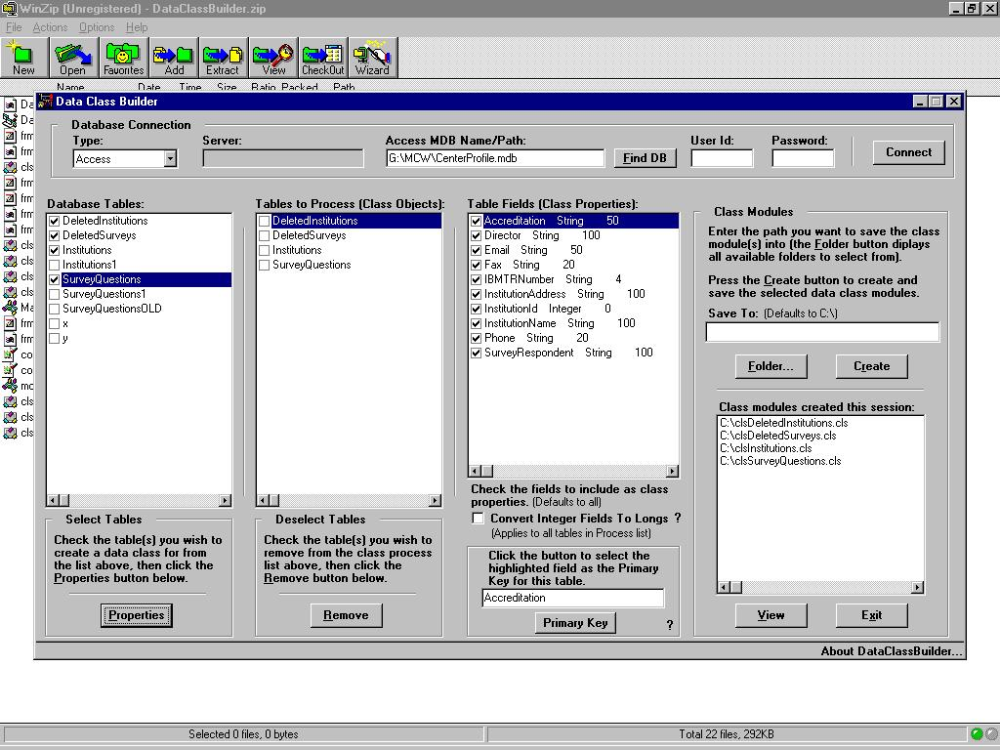



## DataClassBuilder

### Description

DataClassBuilder will query a database you are connected to and allow you to create a class file for each table you select. The class will contain all user-selected fields from a table and create them as class properties along with code for selects (single record), inserts, updates and deletes. It will use the primary key in the various SQL statements created (if the table does not contain a primary key, the program will make its best guess with the fields available and choose one – you can also manually select one). After you create the class you can view it in notepad (via the app). You can then use the class in you Visual Basic application. Currently, the classes are meant to be used with my clsDataAccess class file that comes along with the project. The connection code can easily be replaced if you use your own data access mechanism. I have built classes from Oracle 8.x, Access 97 & 2000, SQL Server, and Sybase 12 (you will need to change the Sybase Connection string to access a Sybase 11 or under database). It has been used at work but has never been fully banged on and I'm sure you may find places where it can be improved (including the too busy-looking GUI). And to be quite honest, I find myself going away from data class objects and collections in preference to Typed arrays (performance is much better).

The created data class will also contain various comments to explain what is going on and what you can do to change some of the code. I have not tried the code on tables with every field-type (mostly text, date, and numeric). Try it and see how it does (let me know). I have fixed the code to allow fields with spaces in them (ugh).

As a side note the project contains some very busy forms (splash, about, and oval form) that demonstrate some API’s and graphics code. The project also contains a few class modules (very heavy with API calls) that I use for many of my projects (logging errors, combobox/listbox and common dialog functionality, file operations, and some Form GUI API functions), along with a Utilities module that contains some useful code. Please enjoy and if you have a better (more efficient or elegant) way of doing something that I am doing, PLEASE let me know. You are free to make any changes to the code and use it in your projects as long as you send me a copy of your changes, as I make it a point to use well written code but want to be able to give credit for it.

Of course, no warranty is implied and all that – have it – use it – enjoy it – and if you find anything useful in the code and you use it (for non-profit), all I ask is that you give me credit, otherwise please let me know. Thanks!

12/9/02: Added checkbox which allows you to set any field Integer data types into Longs inside the class module (some database Integer data types have a much greater Max value than VB).
 
### More Info
 
The application is self-explainatory if a little busy. The project code assumes API and ADO knowledge.

             |
---                |---
**Submitted On**   |2002-12-09 19:43:20
**By**             |[Michael J\. Nugent](https://github.com/Planet-Source-Code/PSCIndex/blob/master/ByAuthor/michael-j-nugent.md)
**Level**          |Intermediate
**User Rating**    |4.9 (161 globes from 33 users)
**Compatibility**  |VB 6\.0
**Category**       |[Complete Applications](https://github.com/Planet-Source-Code/PSCIndex/blob/master/ByCategory/complete-applications__1-27.md)
**World**          |[Visual Basic](https://github.com/Planet-Source-Code/PSCIndex/blob/master/ByWorld/visual-basic.md)
**Archive File**   |[DataClassB1510751292002\.zip](https://github.com/Planet-Source-Code/michael-j-nugent-dataclassbuilder__1-41365/archive/master.zip)

